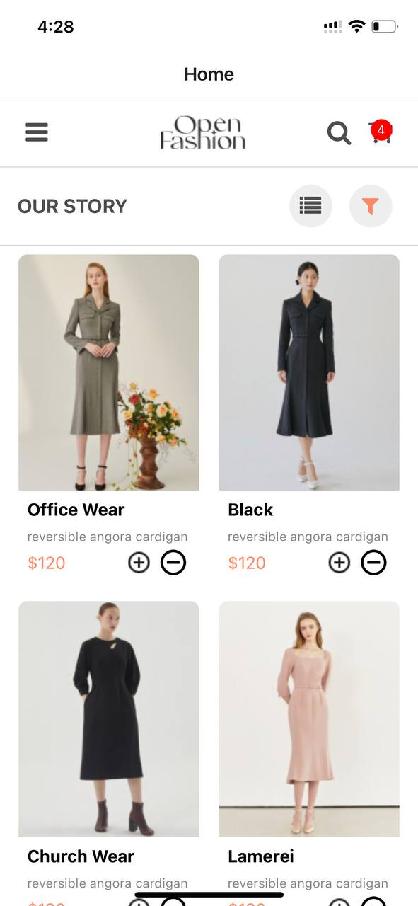

# rn-assignment6-11297233

# Online Shopping App
This is a simple React Native application for online shopping of clothes. It includes a home screen displaying available items, an "add to cart" functionality, and a checkout screen where users can review and remove items from their cart.

## Project Structure
App.js: The main entry point of the application. It sets up the navigation and provides the cart context to the rest of the app.
HomeScreen.js: The home screen displaying the available items and the header with icons.
CheckoutScreen.js: The checkout screen where users can see items in their cart and remove them.
CartContext.js: The context file that manages the state of the cart.
assets/: Directory containing images used in the app.
## Components
HomeScreen
The HomeScreen component displays a list of items available for shopping.
It includes a header with a menu icon, the app title ("Open Fashion"), a search icon, and a cart icon.
Below the header, there is a row with the text "Our Story" and icons for categories and filters.
The main content displays a grid of items, each with an "add to cart" and "remove from cart" button.

## CheckoutScreen
The CheckoutScreen component displays the items added to the cart.
Users can remove items from the cart using the "remove" button.

## CartContext
The CartContext is used to manage the cart state throughout the app.
It provides functions to add and remove items from the cart.

## Navigation
Navigation is handled using React Navigation.
The App.js file sets up the navigation container and stack navigator, defining the HomeScreen and CheckoutScreen as routes.

## Conclusion
This project demonstrates a simple React Native app with a home screen displaying items, an "add to cart" functionality, and a checkout screen. The cart state is managed using a context, and navigation is handled using React Navigation.

